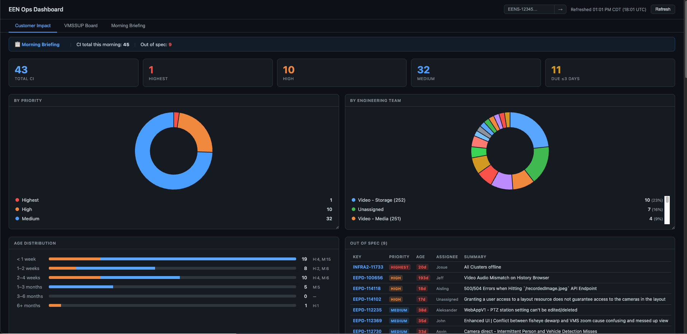

# agarcia-test-tools

Internal tools for Eagle Eye Networks support and engineering operations — dashboards, Claude skills, and QA utilities.

---

## Prerequisites

All tools in this repo authenticate against JIRA using environment variables. Add these to your `~/.zshrc` or `~/.bashrc`:

```bash
export JIRA_URL='https://eagleeyenetworks.atlassian.net'
export JIRA_EMAIL='your-email@een.com'
export JIRA_API_TOKEN='your-api-token'
```

To generate a JIRA API token: go to [id.atlassian.com/manage-profile/security/api-tokens](https://id.atlassian.com/manage-profile/security/api-tokens) → **Create API token**.

After adding to your shell config, run `source ~/.zshrc` to load them.

---

## Tools

### EEN Ops Dashboard

**File:** `scripts/ci-dashboard.py`

A local web dashboard with two tabs that pulls live JIRA data — customer-impact ticket health and a live VMSSUP support board view, both in one place.



#### Tab 1 — Customer Impact

Shows the health of all open customer-impact tickets across EENS, EEPD, and Infrastructure.

| Section | Description |
|---------|-------------|
| Stat tiles | Total CI tickets, Highest/High/Medium counts, Due ≤3 days — all clickable to JIRA |
| By Priority | Doughnut chart — click a segment to open that priority filter in JIRA |
| By Engineering Team | Doughnut chart — click a segment to see that team's tickets inline |
| Age Distribution | Horizontal bar chart bucketed by ticket age (< 1 week → 6+ months) with High/Medium breakdown |
| Out of Spec | Tickets violating SLA: Highest >7d, High >14d, any >28d |
| Due Within 3 Days | Tickets with an approaching due date |
| Repeatedly Punted | Tickets that have been added to 3+ sprints without closing |
| Never in a Sprint | Tickets sitting in backlog with no engineering commitment |

All cards are **resizable** — drag the bottom-right corner. Sizes are saved to `localStorage` and restored on every load.

#### Tab 2 — VMSSUP Board

A live view of the VMSSUP support board, grouped by assignee. Mirrors what you'd see on the JIRA Kanban board but with stall detection added.

| Section | Description |
|---------|-------------|
| Stat tiles | Total open, Highest/High/Medium counts, Stalled ≥3d — all clickable to JIRA |
| Assignee rows | One row per assignee showing their tickets across all 4 active columns |
| Columns | Assistance/To-Do, Triage, Engineering, Support Review |
| Ticket cards | Priority-colored left border, summary, JIRA key, and age |
| Stalled section | High/Highest tickets with no update in ≥3 days |

Assignee rows are **collapsible** — click the row header to expand/collapse.

**Setup:**

```bash
# Install dependencies
pip install -r scripts/requirements.txt

# Run
python3 scripts/ci-dashboard.py
```

Then open **http://localhost:8081** in your browser.

To run on a different port:
```bash
CI_DASH_PORT=9000 python3 scripts/ci-dashboard.py
```

---

### Morning Briefing (Claude Code Skill)

**File:** `claude-skills/morning-briefing/SKILL.md`

A Claude Code skill that runs a full daily JIRA briefing and sends it to Zulip as a DM.

**What it covers:**

| Section | Description |
|---------|-------------|
| New tickets since yesterday | New VMSSUP support tickets + new EEPD customer-impact tickets |
| High priority open | VMSSUP high/highest tickets, flagged if no movement in ≥3 days |
| Medium priority open | VMSSUP medium tickets, flagged if stalled ≥7 days |
| Total open customer impact | Age distribution chart with priority breakdown and delta vs. yesterday |
| Out of spec work items | CI tickets violating SLA thresholds by priority |
| Sprint carry-over | Repeatedly punted / carried over / never in sprint breakdown |
| Open tickets by engineering team | Per-team CI ticket counts with High/Medium breakdown and deltas |
| Needs team response | Tickets waiting on a team reply, urgency-scored via jira-stalker |

Also generates a full markdown report saved to `~/Documents/Morning Briefing/` and uploads it as an attachment to the Zulip DM.

**Additional env vars required:**

```bash
export ZULIP_EMAIL='your-email@een.com'
export ZULIP_API_KEY='your-zulip-api-key'
export ZULIP_SITE='https://chat.eencloud.com'
export ZULIP_USER_ID='your-zulip-user-id'  # numeric ID, find at chat.eencloud.com/#settings/account
```

**How to run:**

In Claude Code, type:
```
/morning-briefing
```

To install the skill, copy `claude-skills/morning-briefing/SKILL.md` to:
```
~/.claude/skills/morning-briefing/SKILL.md
```

---

## Repository Structure

```
agarcia-test-tools/
├── README.md                                   # This file
├── screenshots/
│   └── ci-dashboard.png                        # Dashboard screenshot
├── scripts/
│   ├── ci-dashboard.py                         # EEN Ops Dashboard (CI Health + VMSSUP Board)
│   └── requirements.txt                        # Python dependencies
├── claude-skills/
│   └── morning-briefing/
│       └── SKILL.md                            # Claude Code morning briefing skill
├── qa-starter-kit/                             # QA templates, commands, and workflows
│   └── README.md                               # QA toolbox docs
└── Notes/                                      # Reference docs and architecture notes
```

---

## License

Internal use for Eagle Eye Networks.
